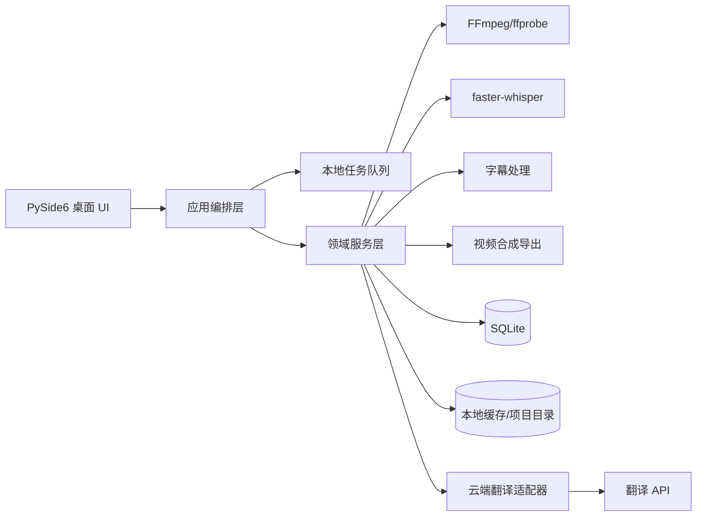
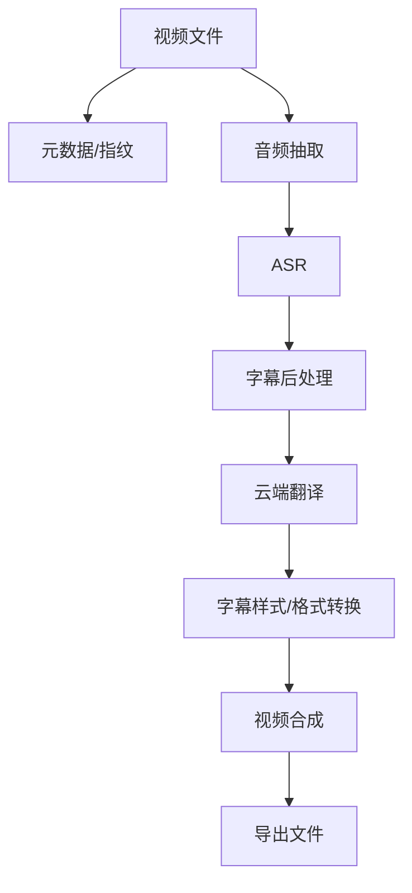

# 视频字幕生成与翻译软件应用框架设计

## 1. 产品定位与核心能力

**一句话定位**

一款面向 Windows 桌面的本地优先视频字幕生成、翻译、合成与导出工具。

**MVP 必须包含**

1. 本地导入视频文件
2. 本地抽取音频
3. 本地语音识别生成字幕
4. 调用云端翻译接口翻译字幕
5. 本地字幕校时、分段、格式转换
6. 本地字幕烧录或外挂导出
7. 任务进度、日志、失败重试
8. 导出最终视频文件

**后续扩展**

1. 更多 ASR 引擎
2. 更多翻译引擎
3. 批量处理
4. GPU 加速
5. 本地模型与云模型切换
6. 字幕样式编辑器
7. 多语言双语字幕
8. 项目模板与任务队列复用

---

## 2. 技术架构总览

### 推荐架构

采用**单机 Windows 桌面应用 + 本地 Python 核心服务 + 云端翻译适配层**的结构。



### 为什么这样分层

1. **UI 与计算解耦**：避免视频处理阻塞界面。
2. **本地处理优先**：满足隐私、成本与离线可用性。
3. **任务可持久化**：支持重试、断点续跑、崩溃恢复。
4. **适配器隔离**：ASR、翻译、导出实现可替换。

### 各层职责

| 层 | 职责 |
|---|---|
| UI 层 | 文件选择、参数配置、进度展示、日志展示、导出操作 |
| 应用编排层 | 组织工作流，协调各模块执行顺序 |
| 领域服务层 | 字幕生成、翻译、分段、对齐、合成等核心业务 |
| 基础设施层 | FFmpeg、SQLite、文件系统、云 API、日志、缓存 |
| 任务执行层 | 后台队列、进程池、重试、恢复、状态持久化 |

### Python 的核心职责

Python 应承担以下核心职责：

1. 业务编排
2. 本地任务调度
3. 视频/音频处理调用
4. ASR 调用
5. 字幕切分与对齐
6. 翻译请求封装
7. 导出流程控制
8. 数据持久化

### 是否需要前后端分离

**不需要传统前后端分离。**

这是单机桌面软件，推荐：

- UI 与业务逻辑同仓库
- UI 通过信号/槽或事件总线调用后端服务
- 不引入独立 Web 前端和独立后端部署复杂度

### Windows 桌面技术方案

**推荐：PySide6**

理由：

1. Qt 生态成熟，适合 Windows 桌面
2. 界面、对话框、拖拽、表格、进度条、线程信号支持完善
3. 与 Python 集成直接
4. 适合做任务状态、日志、批处理、参数面板

### 其他关键技术

- **音视频处理**：FFmpeg + ffprobe
- **语音识别**：`faster-whisper` 优先，必要时可切换云 ASR
- **翻译**：云端大模型 API
- **异步处理**：Qt 事件循环 + 后台任务队列 + `ProcessPoolExecutor`
- **存储**：SQLite + 本地项目目录

---

## 3. 模块拆分

### 模块清单

| 模块 | 职责 | 输入 | 输出 | 边界 |
|---|---|---|---|---|
| 桌面 UI 模块 | 交互、状态展示、参数输入 | 用户操作 | 任务指令 | 不直接做重计算 |
| 文件导入模块 | 校验视频、创建项目 | 视频路径 | 项目记录 | 只负责接入 |
| 视频预处理模块 | 读取元数据、抽帧、抽音频 | 视频文件 | 元数据、音频信息 | 不做业务判断 |
| 音频抽取模块 | 抽取 WAV/FLAC | 视频文件 | 音频文件 | 只依赖 FFmpeg |
| 语音识别模块 | 音频转文本 | 音频片段 | 字幕草稿 | 可替换引擎 |
| 字幕后处理模块 | 分句、断句、对齐、格式化 | 原始字幕 | 标准字幕 | 不依赖 UI |
| 翻译模块 | 翻译字幕文本 | 字幕文本 | 翻译字幕 | 仅上传字幕文本 |
| 字幕样式模块 | SRT/ASS 样式、字体、位置 | 字幕与样式参数 | 渲染参数 | 与导出解耦 |
| 视频合成模块 | 烧录字幕或封装外挂字幕 | 视频+字幕 | 输出视频 | 仅做合成 |
| 导出模块 | 保存路径、编码参数、格式 | 任务结果 | 成品文件 | 支持中断恢复 |
| 本地任务队列模块 | 调度、重试、并发控制 | 任务描述 | 任务状态 | 持久化执行 |
| 配置管理模块 | 用户设置、引擎配置 | 配置文件/DB | 运行参数 | 集中管理 |
| 日志与监控模块 | 运行日志、错误、耗时 | 事件 | 日志记录 | 支持追踪 |
| 本地数据库模块 | 项目、任务、字幕、导出记录 | 结构化数据 | 查询结果 | SQLite |
| 云端翻译适配模块 | API 适配、限流、重试 | 翻译请求 | 翻译结果 | 只处理文本 |

### 推荐边界原则

1. UI 不直接依赖 FFmpeg 细节
2. ASR、翻译、导出都通过统一接口访问
3. 所有任务状态都要写本地数据库
4. 所有临时产物都放在项目目录下可清理的位置

---

## 4. 核心处理流程

### 完整流程

1. 用户选择视频文件
2. 系统创建项目目录与任务记录
3. 读取视频元数据，生成文件指纹
4. 检查缓存与历史产物，判断是否可复用
5. 抽取音频到本地临时目录
6. 音频切分或整段送入本地 ASR
7. 生成初版字幕
8. 字幕后处理：分句、去重、对齐、格式化
9. 仅上传字幕文本到云端翻译 API
10. 合并翻译结果，生成目标字幕文件
11. 根据用户选择执行外挂字幕导出或烧录字幕
12. 输出最终视频文件
13. 写入导出记录，清理临时文件

### 数据流转



### 临时文件管理

建议每个项目独立目录：

```text
project_id/
  source/
  temp/
  cache/
  subtitles/
  exports/
  logs/
```

规则：

1. 临时文件只放 `temp/`
2. 可复用中间产物放 `cache/`
3. 正式字幕放 `subtitles/`
4. 成品放 `exports/`

### 大文件避免重复处理

1. 用文件大小、修改时间、SHA256 或分片 hash 生成指纹
2. 缓存音频抽取结果
3. 缓存 ASR 分段结果
4. 缓存翻译结果
5. 同一视频改参数时只重跑受影响步骤

### 长视频分段处理

1. 按固定时长切块，例如 5 到 15 分钟
2. 边界保留少量重叠，避免句子截断
3. ASR 分段结果按时间轴回填
4. 翻译以字幕条为单位进行
5. 合成前统一做全局时间轴校正

### 失败恢复位置

每一步都写入状态：

- 已导入
- 已抽音频
- 已识别
- 已翻译
- 已合成
- 已导出

恢复时从最后一个成功步骤继续，不重复执行已完成步骤。

### UI 不阻塞

1. UI 线程只负责交互
2. 重任务放入后台队列
3. 用信号/槽或事件总线推送进度
4. 任务状态变化写入数据库后再通知界面

### 本地与云端边界

**完全本地执行**

- 视频读取
- 音频抽取
- 语音识别
- 字幕切分、对齐、格式转换
- 字幕合成
- 视频导出
- 任务调度
- 日志记录
- 缓存与存储

**可调用云端**

- 字幕翻译

**云端只传输**

- 字幕文本
- 目标语言
- 可选上下文片段

**不上传**

- 原始视频
- 原始音频
- 本地项目目录

---

## 5. 目录结构设计

```text
zero-caption/
  app/
    main.py
    bootstrap.py
  ui/
    windows/
    widgets/
    dialogs/
    models/
  core/
    usecases/
    services/
    domain/
    dto/
  infrastructure/
    media/
      ffmpeg.py
      probe.py
    asr/
      base.py
      faster_whisper_impl.py
    translation/
      base.py
      cloud_llm.py
    subtitle/
      srt.py
      ass.py
      align.py
    export/
      burn_in.py
      mux.py
    storage/
      sqlite.py
      repositories.py
    task/
      queue.py
      executor.py
      retry.py
    logging/
      logger.py
  config/
    settings.py
    profiles/
  resources/
    icons/
    fonts/
    themes/
  data/
    projects/
    cache/
    exports/
  tests/
    unit/
    integration/
  scripts/
  docs/
  design/
```

---

## 6. 关键技术选型对比

### PySide6 vs PyQt6 vs Tauri

| 方案 | 优点 | 缺点 | 推荐度 |
|---|---|---|---|
| PySide6 | Qt 原生、Python 集成好、适合桌面工具 | 需要熟悉 Qt 体系 | 高 |
| PyQt6 | 成熟稳定、生态类似 | 授权约束更敏感 | 中 |
| Tauri + Python 后端 | 前端灵活、界面轻 | 架构复杂、桌面与后端分离成本高 | 低 |

**推荐：PySide6**

当前项目更偏本地生产力工具，PySide6 的开发效率、桌面体验和维护成本最平衡。

### Whisper vs faster-whisper vs 云 ASR

| 方案 | 优点 | 缺点 | 推荐度 |
|---|---|---|---|
| Whisper | 识别质量高，方案通用 | 推理慢、资源占用高 | 中 |
| faster-whisper | 更快、更省内存、适合本地批处理 | 仍需本地算力 | 高 |
| 云 ASR | 部署简单、可扩展 | 成本、隐私、延迟、依赖网络 | 作为可选兜底 |

**推荐：faster-whisper 为默认本地引擎，云 ASR 作为可选后备**

### 本地翻译 vs 云端大模型翻译

| 方案 | 优点 | 缺点 | 推荐度 |
|---|---|---|---|
| 本地翻译 | 离线、隐私好 | 质量和维护成本较高 | 低 |
| 云端大模型翻译 | 质量高、可控性强 | 成本、延迟、限流、隐私 | 高 |

**推荐：字幕翻译使用云端大模型 API**

### 内嵌字幕烧录 vs 外挂字幕导出

| 方案 | 优点 | 缺点 | 推荐度 |
|---|---|---|---|
| 内嵌烧录 | 兼容性强，直接可播放 | 耗时长、不可编辑 | 作为导出选项 |
| 外挂字幕 | 快、可编辑、可复用 | 播放器支持依赖外部环境 | 作为默认推荐 |

**推荐：默认外挂字幕，烧录作为高兼容导出模式**

### 多线程 vs 多进程 vs 任务队列

| 方案 | 优点 | 缺点 | 推荐度 |
|---|---|---|---|
| 多线程 | 简单，适合 UI 通知 | CPU 密集场景受 GIL 限制 | 仅用于 UI 协调 |
| 多进程 | 适合 CPU 密集任务 | 管理复杂，状态同步要求高 | 高 |
| 任务队列 | 可恢复、可重试、可持久化 | 需要额外设计 | 高 |

**推荐：UI 线程 + 后台任务队列 + 多进程执行重计算**

---

## 7. 性能与稳定性设计

### 2GB 大文件处理策略

1. 视频流式读取，不一次性载入内存
2. 音频单独抽取
3. 中间文件分层存储
4. 处理过程按块推进
5. 输出文件采用分步写入，避免重复编码

### 2 小时长视频处理策略

1. 按章节或固定时长切块
2. 每块独立识别
3. 识别结果统一拼接
4. 句间保留重叠校正
5. 导出前做一次总校对

### 内存控制

1. 禁止整段音视频转内存对象
2. 只保留当前处理窗口
3. 模型按需加载，任务结束后释放
4. 大结果落盘，不驻留 UI 内存

### GPU / CPU 利用

1. ASR 优先支持 GPU
2. 无 GPU 时切换 CPU 模式
3. 视频合成优先用 FFmpeg 硬件编码
4. 多任务时限制并发数，避免系统卡顿

### 后台任务执行

1. 识别、翻译、合成都走后台任务
2. 每个任务有状态机
3. 状态变化写数据库
4. UI 只订阅状态，不直接持有执行逻辑

### 进度条与状态管理

建议拆成三层进度：

1. 总任务进度
2. 当前步骤进度
3. 当前文件块进度

### 崩溃恢复

1. 每步完成即持久化
2. 启动时扫描未完成任务
3. 根据 checkpoint 继续
4. 关键中间产物存在则复用

### 失败重试

1. 网络失败重试翻译请求
2. FFmpeg 失败保留日志并可重新合成
3. ASR 失败允许重新分段识别
4. 重试要带指数退避和最大次数

### 临时文件清理

1. 完成后保留正式产物
2. 临时产物默认延迟清理
3. 项目关闭时可手动清理
4. 过期缓存按策略清理

### 日志追踪

1. 每个项目单独日志文件
2. 每个步骤带耗时与错误码
3. 关键外部调用保留请求摘要
4. 便于用户导出诊断包

### 云端翻译失败降级

1. 自动重试
2. 切换备用翻译提供方
3. 降级为本地词典/规则翻译
4. 保留未翻译字幕，允许稍后补翻译

---

## 8. 数据存储设计

### 是否需要 SQLite

**需要。**

原因：

1. 适合单机桌面软件
2. 支持任务、项目、字幕版本、导出记录
3. 支持断点恢复和历史追踪
4. 部署简单

### 建议存储内容

| 数据类型 | 内容 |
|---|---|
| 项目记录 | 视频路径、指纹、创建时间、状态 |
| 任务记录 | 步骤状态、重试次数、耗时、错误信息 |
| 字幕版本 | 原始字幕、翻译字幕、样式版本 |
| 导出记录 | 输出路径、编码参数、导出时间 |
| 缓存索引 | 中间产物路径、命中条件、有效期 |
| 配置 | 引擎选择、API Key、默认语言、样式参数 |

### 项目记录与字幕版本

建议按项目维度组织：

- 一个视频对应一个项目
- 一个项目下可以有多个字幕版本
- 每次翻译或重跑都生成新版本

### 临时产物与正式产物

1. 临时产物放项目目录下 `temp/`
2. 正式字幕放 `subtitles/`
3. 导出视频放 `exports/`
4. 可复用中间结果放 `cache/`

### 缓存机制

需要缓存：

1. 音频抽取结果
2. ASR 结果
3. 翻译结果
4. 导出参数对应的成品索引

---

## 9. 可扩展性设计

### 统一接口

建议为关键能力定义抽象接口：

```python
class AsrEngine:
    def transcribe(self, audio_path, options): ...

class Translator:
    def translate(self, segments, target_lang, options): ...

class SubtitleComposer:
    def render(self, subtitles, style, output_path): ...

class VideoExporter:
    def export(self, source_video, subtitle_file, mode, output_path): ...
```

### 支持切换的方向

1. 不同 ASR 引擎切换
2. 不同翻译引擎切换
3. 不同字幕合成方式切换
4. 本地模型与云模型切换
5. 后续插件化

### 插件化能力建议

1. 引擎注册表
2. 配置驱动选择
3. 统一输入输出数据结构
4. 扩展点只暴露协议，不暴露内部实现

---

## 10. 风险与难点

| 风险 | 影响 | 缓解方案 |
|---|---|---|
| 长视频处理时间过长 | 用户等待时间长 | 分段、进度展示、断点恢复 |
| 语音识别精度不足 | 字幕质量差 | 选择更强模型、VAD、手动校正 |
| 翻译质量不稳定 | 字幕语义偏差 | 上下文补充、术语表、人工复核 |
| 时间轴错位 | 观看体验差 | 重叠切块、对齐校正、回看预览 |
| 烧录速度慢 | 导出耗时 | 提供外挂字幕默认模式 |
| Windows 打包复杂 | 发布难度高 | 固定依赖版本，统一打包流程 |
| 云 API 成本与限流 | 成本上升、失败 | 缓存、批处理、重试、备用供应商 |
| 隐私风险 | 用户不信任 | 只上传字幕文本，明示边界 |

---

## 11. MVP 落地建议

### 第一阶段

1. 单文件导入
2. 本地抽音频
3. 本地 ASR
4. 云端翻译
5. SRT 导出
6. 外挂字幕视频导出

### 第二阶段

1. ASS 样式
2. 烧录字幕
3. 任务队列
4. 断点续跑
5. 日志和历史项目

### 第三阶段

1. 批量处理
2. 多引擎切换
3. GPU 加速
4. 本地模型与云模型切换
5. 双语字幕

### 先不做的功能

1. 在线协作
2. 复杂字幕编辑器
3. 多平台统一发布
4. 过早插件市场化

### 最小成本验证

先验证三件事：

1. 本地 ASR 质量是否够用
2. 云翻译是否稳定
3. 导出流程在长视频上是否可控

---

## 12. 最终建议方案

### 推荐技术栈

| 项目 | 方案 |
|---|---|
| UI 框架 | PySide6 |
| Python 后端组织方式 | 分层架构 + 用例服务 + 适配器 |
| 任务执行机制 | SQLite 持久化任务队列 + 多进程执行 |
| 语音识别方案 | `faster-whisper` |
| 翻译方案 | 云端大模型 API |
| 字幕处理方案 | 自研字幕后处理 + SRT/ASS 适配 |
| 视频导出方案 | FFmpeg |
| 数据存储方案 | SQLite + 本地项目目录 |
| 打包发布方案 | PyInstaller 或 Nuitka + FFmpeg 资源随包 |

### 最终判断

这是一个**以本地处理为主、云端仅负责翻译、可持续扩展的 Windows 单机生产力软件**。  
最稳妥的第一版不是“全功能大而全”，而是把**导入-识别-翻译-导出**这条主链路做稳定。

---

## 推荐目录结构示例

```text
zero-caption/
  app/
    main.py
    bootstrap.py
  ui/
    windows/
    widgets/
    dialogs/
    models/
  core/
    usecases/
    services/
    domain/
    dto/
  infrastructure/
    media/
    asr/
    translation/
    subtitle/
    export/
    storage/
    task/
    logging/
  config/
    settings.py
    profiles/
  resources/
    icons/
    fonts/
    themes/
  data/
    projects/
    cache/
    exports/
  tests/
    unit/
    integration/
  scripts/
  docs/
  design/
```

## MVP 技术栈结论表

| 维度 | 结论 |
|---|---|
| UI | PySide6 |
| 核心语言 | Python |
| 音视频处理 | FFmpeg |
| ASR | faster-whisper |
| 翻译 | 云端大模型 API |
| 任务执行 | 本地持久化任务队列 + 多进程 |
| 数据存储 | SQLite |
| 导出 | 外挂字幕优先，烧录字幕可选 |
| 打包 | PyInstaller / Nuitka |

